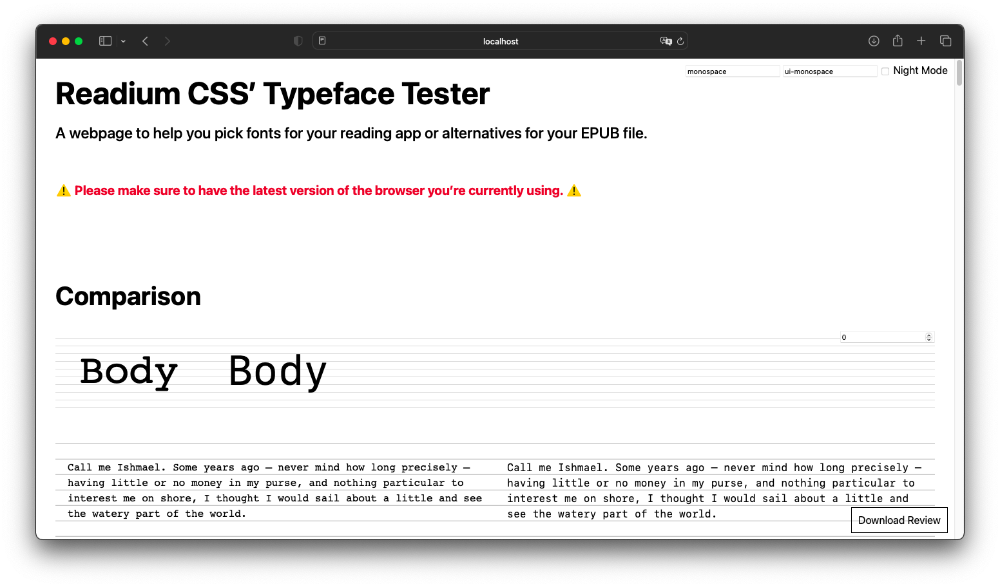
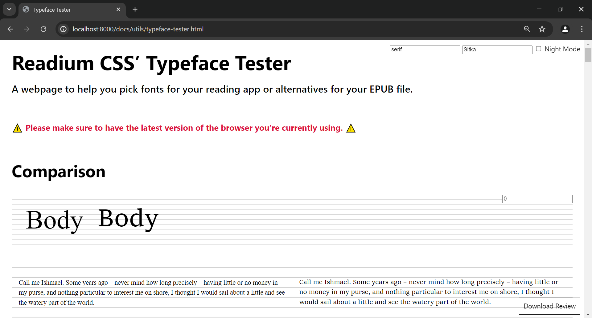
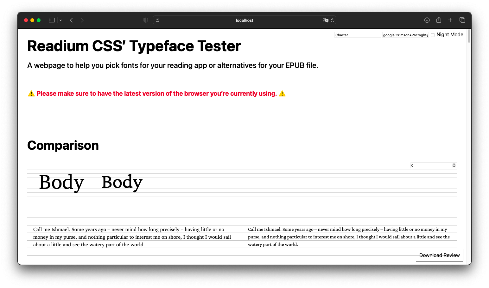
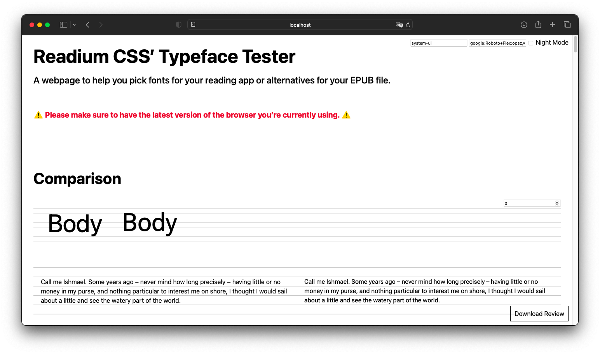

# Variable Fonts

[Implementers’ doc] [WIP]

With the advent of variable fonts, the font-weight user setting has become a staple in terms of Reader Experience in various ecosystems, and version 2 of ReadiumCSS ships with custom properties specific to these fonts i.e. `--USER__fontWeight`, `--USER__fontWidth`, and `--USER__fontOpticalSizing`. 

The custom properties were chosen as they are part of the registered, or most common axes (see [MDN’s Variable fonts guide](https://developer.mozilla.org/en-US/docs/Web/CSS/CSS_fonts/Variable_fonts_guide) for more). But that doesn’t mean all variable fonts support these axes.

By very far, the most common axis is `font-weight`, which might explain why reading apps and devices limit user settings to it. And why you actually might want too, as handling the font variation settings on a font basis might not fit your User Experience.

In addition, availability of bundled/system fonts in OSes makes it even more challenging, which is why we are providing a list of variable fonts you can embed/bundle/import in your Reading System or app.

## Challenges 

### Font-weight and font-width ranges can vary

The ranges a variable font offers can vary quite a lot, with some fonts offering weights from thin (hairline) (`100`) to extra-black (`1000`) while others may only offer from normal (`400`) to bold (`700`). Same for width (`font-stretch`).

This means the weight user setting of your Reading System/app may end up being relative to the variable font that is currently used.

And this is the reason why these ranges are mentionned for each variation the font supports.

### Font-stacks and fallbacks

Take the following font-stack:

```
font-family: Athelas, Constantia, Georgia, serif;
```

A fallback is a font face that is used when the primary font face is not available, or is missing glyphs (characters) necessary to render page content. In other words, if the first font (Athelas) is not available on the system, the rendering engine will fall back on the next ones (Constantia, Georgia), until it finds a match. `serif` is the generic family that makes sure it will at least pick a font in the same family (`sans-serif`, `serif`, `cursive`, `fantasy`, or `monospace`).

Usually, you will end up with font faces that are commonly bundled in OSes (system fonts) like Segoe, Helvetica, or Georgia, etc. to get a better-looking alternative than the default for the generic family. 

Unfortunately, the challenge with variable fonts is that few of the system fonts actually are variable. Which makes it very challenging to create font-stacks with extensive fallbacks. 

To date, it seems that you can only cover MacOS and iOS reliably, thanks to San Francisco (SF Pro for `sans-serif`, SF Mono for `monospace`) and New York (`serif`).

This means your variable font stacks will look something like this.

```
/** Sans-serif **/
font-family: "Name of your variable font", ui-sans-serif, system-ui, -apple-system, BlinkMacSystemFont, sans-serif;

/** Serif **/
font-family: "Name of your variable font", ui-serif, serif;

/** Monospace **/
font-family: "Name of your variable font", ui-monospace, monospace;
```

If anything it shows how important it is at the moment to: 

1. make sure the variable fonts you’ll pick can be loaded reliably; 
2. cover the languages you’re targeting.

## System Fonts

It is important to note OSes may bundle fonts in a wide variety of weights, but that are not variable fonts *per se* e.g. True Type Collection (`.ttc`).

This is the case for Helvetica Neue or Seravek, but this means their weight can not be arbitrarily set on a range, they only offers predefined values (`100, 200, 300, 400, 500, 700`).

You may however find that acceptable as pseudo-variable fonts to expose to users since the `--USER__fontWeight` setting will mostly work as expected, or at least fallback fonts.
 
### MacOS/iOS

#### San Francisco Pro (sans-serif)


CSS Mapping: `ui-sans-serif`

OpenType Features: small caps, numeric spacing values.

Variations: weight (`1–1000`), width (`30–150`), optical sizing.

#### New York (serif)


CSS Mapping: `ui-serif`

OpenType Features: small caps, numeric figure values, numeric spacing values.

Variations: weight (`400–1000`), optical sizing.

#### San Francisco Mono (monospace)



CSS Mapping: `ui-monospace`

OpenType Features: small caps.

Variations: weight (`300–900`).

### Windows 11

#### Segoe UI Variable (sans-serif)


CSS Mapping: `Segoe UI Variable`

OpenType Features: small caps, numeric figure values.

Variations: weight (`200–700`), optical sizing.

#### Sitka (serif)



CSS Mapping: `Sitka`

OpenType Features: small caps, numeric figure values.

Variations: weight (`400–700`), optical sizing.

### Others

TBD

## How were these fonts picked

The overarching goal was to provide variable fonts mapped to the default stacks listed in [Typefaces and font-stacks](CSS09-default_fonts.md) e.g. in Latin, Old Style, Modern, Neutral, Humanist, and monospace.

Then, each of the fonts has been undergoing tests in real rendering situations. 

They were rendered on the Android, iOS, MacOS, and Windows platforms, using SD and HD displays when possible, in multiple browsers (Edge, Safari, Chrome, Firefox), and in different reading modes (day, sepia, night).

Then each font was:

1. compared to its closest reference (system font);
2. tested against the latin, cyrillic and greek alphabets and languages;
3. tested against the small capitals and numeric OpenType features;
4. tested against the font-width, font-weight, and optical-sizing variations.

## Latin

### Old Style (serif)

#### Newsreader


Global info:

- Source: https://github.com/productiontype/Newsreader
- Google Fonts: YES
- Design: Production Type
- License: SIL-OFL

Technical details:

- Reference: Palatino
- Classification: Old Style

Supported Languages: Albanian, Bosnian, Czech, Danish, Dutch, Estonian, Finnish, French, German, Hungarian, Italian, Latvian, Lithuanian, Norwegian, Polish, Portuguese, Romanian, Slovak, Slovenian, Spanish, Swedish, Turkish.

OpenType Features: none.

Variations: weight (`200–800`), optical sizing.

#### EB Garamond


Global info:

- Source: https://github.com/georgd/EB-Garamond
- Google Fonts: YES
- Design: Georg Duffner, Octavio Pardo
- License: SIL-OFL

Technical details:

- Reference: Iowan Old Style
- Classification: Old Style

Supported Languages: Albanian, Bosnian, Czech, Danish, Dutch, Estonian, Finnish, French, German, Hungarian, Italian, Latvian, Lithuanian, Norwegian, Polish, Portuguese, Romanian, Slovak, Slovenian, Spanish, Swedish, Turkish, Greek, Russian.

OpenType Features: none.

Variations: weight (`400–800`)

#### Crimson Pro



Global info:

- Source: https://github.com/Fonthausen/CrimsonPro
- Google Fonts: YES
- Design: Jacques Le Bailly
- License: SIL-OFL

Technical details:

- Reference: Charter
- Classification: Old Style

Supported Languages: Albanian, Bosnian, Czech, Danish, Dutch, Estonian, Finnish, French, German, Hungarian, Italian, Latvian, Lithuanian, Norwegian, Polish, Portuguese, Romanian, Slovak, Slovenian, Spanish, Swedish, Turkish.

OpenType Features: none.

Variations: weight (`200–900`)

### Modern (serif)

#### From Open source and libre fonts we already recommended

- [Faustina](CSS10-libre_fonts.md#faustina)
- [Literata](CSS10-libre_fonts.md#literata)
- [Vollkorn](CSS10-libre_fonts.md#vollkorn)

#### Roboto Serif


Global info:

- Source: https://github.com/CommercialType/RobotoSerif
- Google Fonts: YES
- Design: Commercial Type, Greg Gazdowicz
- License: SIL-OFL

Technical details:

- Reference: Georgia
- Classification: Modern

Supported Languages: Albanian, Bosnian, Czech, Danish, Dutch, Estonian, Finnish, French, German, Hungarian, Italian, Latvian, Lithuanian, Norwegian, Polish, Portuguese, Romanian, Slovak, Slovenian, Spanish, Swedish, Turkish, Russian.

OpenType Features: none.

Variations: weight (`100–900`), width (`50–150`), optical sizing

#### Source Serif Pro


Global info:

- Source: http://github.com/adobe-fonts/source-serif-pro/releases/latest
- Google Fonts: YES
- Design: Frank Grießhammer
- License: SIL-OFL

Technical details:

- Reference: Georgia
- Classification: Modern

Supported Languages: Albanian, Bosnian, Czech, Danish, Dutch, Estonian, Finnish, French, German, Hungarian, Italian, Latvian, Lithuanian, Norwegian, Polish, Portuguese, Romanian, Slovak, Slovenian, Spanish, Swedish, Turkish, Greek, Russian.

OpenType Features: none.

Variations: weight (`200–900`), optical sizing

### Neutral (sans-serif)

#### From Open source and libre fonts we already recommended

- [IBM Plex Sans](CSS10-libre_fonts.md#ibm-plex-sans)
- [Libre Franklin](CSS10-libre_fonts.md#libre-franklin)
- [Merriweather Sans](CSS10-libre_fonts.md#merriweather-sans)

#### Roboto Flex



Global info:

- Source: https://github.com/googlefonts/roboto-flex
- Google Fonts: YES
- Design: Font Bureau, David Berlow, Santiago Orozco, Irene Vlachou, Ilya Ruderman, Yury Ostromentsky, Mikhail Strukov
- License: SIL-OFL

Technical details:

- Reference: San Francisco (SF Pro)
- Classification: Sans serif

Supported Languages: Albanian, Bosnian, Czech, Danish, Dutch, Estonian, Finnish, French, German, Hungarian, Italian, Latvian, Lithuanian, Norwegian, Polish, Portuguese, Romanian, Slovak, Slovenian, Spanish, Swedish, Turkish, Greek, Russian.

OpenType Features: none.

Variations: weight (`100–1000`), width (`25–151`), optical sizing

#### Public Sans


Global info:

- Source: https://github.com/uswds/public-sans
- Google Fonts: YES
- Design: USWDS, Dan Williams, Pablo Impallari, Rodrigo Fuenzalida
- License: SIL-OFL

Technical details:

- Reference: San Francisco (SF Pro)
- Classification: Sans serif

Supported Languages: Albanian, Bosnian, Czech, Danish, Dutch, Estonian, Finnish, French, German, Hungarian, Italian, Latvian, Lithuanian, Norwegian, Polish, Portuguese, Romanian, Slovak, Slovenian, Spanish, Swedish, Turkish.

OpenType Features: numeric spacing values.

Variations: weight (`100–900`)

### Humanist (sans-serif)

#### From Open source and libre fonts we already recommended

- [Source Sans Pro](CSS10-libre_fonts.md#source-sans-pro)

#### Cabin


Global info:

- Source: https://github.com/impallari/Cabin
- Google Fonts: YES
- Design: Impallari Type, Rodrigo Fuenzalida
- License: SIL-OFL

Technical details:

- Reference: Gill Sans
- Classification: Humanist

Supported Languages: Albanian, Bosnian, Czech, Danish, Dutch, Estonian, Finnish, French, German, Hungarian, Italian, Latvian, Lithuanian, Norwegian, Polish, Portuguese, Romanian, Slovak, Slovenian, Spanish, Swedish, Turkish.

OpenType Features: none.

Variations: weight (`400–700`), width (`75–100`)

### Monospace

#### Source Code Pro


Global info:

- Source: https://github.com/adobe-fonts/source-code-pro/releases/latest
- Google Fonts: YES
- Design: Paul D. Hunt
- License: SIL-OFL

Technical details:

- Reference: San Francisco Mono
- Classification: monospace

Supported Languages: Albanian, Bosnian, Czech, Danish, Dutch, Estonian, Finnish, French, German, Hungarian, Italian, Latvian, Lithuanian, Norwegian, Polish, Portuguese, Romanian, Slovak, Slovenian, Spanish, Swedish, Turkish, Greek, Russian.

OpenType Features: none.

Variations: weight (`200–900`)

## Arabic (ar) and Persian (fa)

### Estedad

Global info:

- Source: https://github.com/aminabedi68/Estedad
- Google Fonts: No
- Design: Amin Abedi
- License: SIL-OFL

OpenType Features: small capitals, numeric figure values, numeric spacing values.

Variations: weight (`100–900`)

### Markazi Text

Global info:

- Source: https://github.com/BornaIz/markazitext
- Google Fonts: YES
- Design: Borna Izadpanah, Florian Runge, Fiona Ross
- License: SIL-OFL

OpenType Features: none.

Variations: weight (`400–700`)